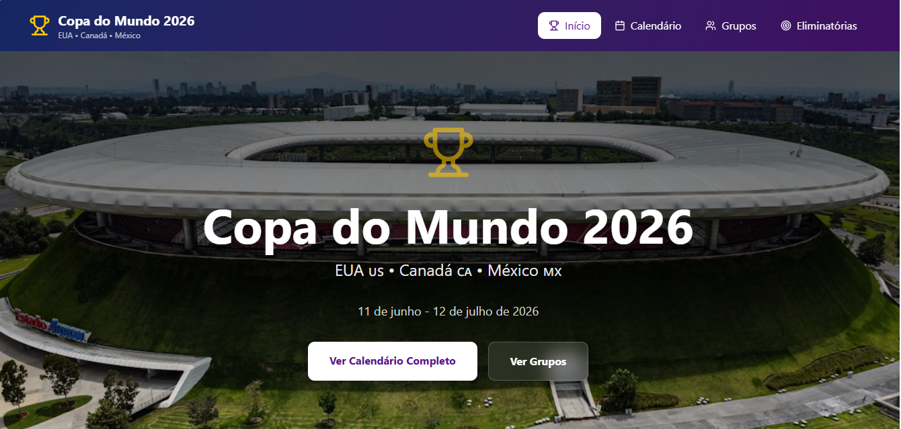
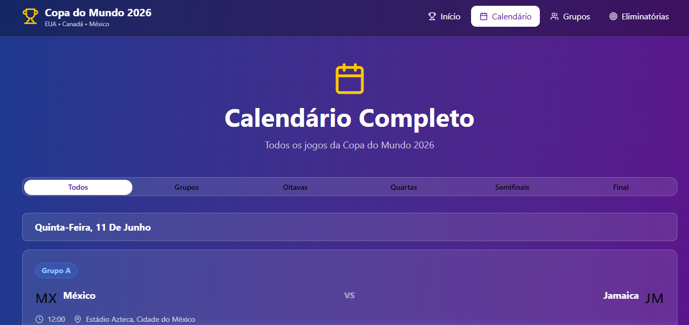
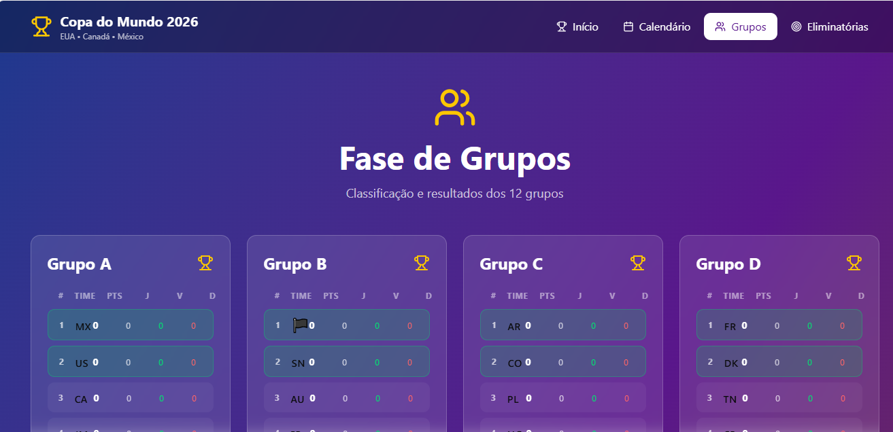
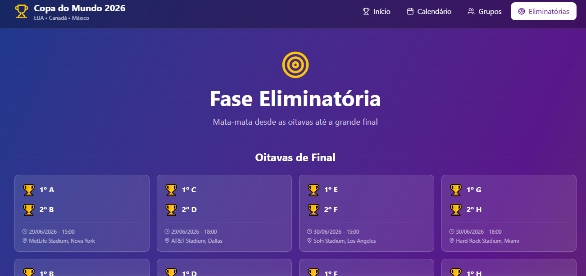

# Calendário Copa 2026

Um site interativo para visualizar o calendário da Copa do Mundo de 2026, incluindo grupos, jogos, fases eliminatórias e muito mais. Este projeto foi desenvolvido com tecnologias modernas para oferecer uma experiência de usuário rica e responsiva.


## Funcionalidades

- Página Inicial: Visão geral da Copa 2026.
- Calendário: Lista completa de jogos e datas.
- Grupos: Detalhes dos grupos e equipes participantes.
- Fases Eliminatórias: Simulação das fases knockout.
- Interface Responsiva: Compatível com dispositivos móveis e desktop.
- Tema Personalizado: Utilizando Shadcn UI e Tailwind CSS para um design moderno.

## Tecnologias Utilizadas

Dependências Principais
- **React**: 18.3.1 - Biblioteca para construção de interfaces de usuário.
- **React DOM**: 18.3.1 - Renderização do React no DOM.
- **React Router**: 7.13.0 - Roteamento para aplicações React.
- **Vite**: 6.3.5 - Ferramenta de build rápida para desenvolvimento.
- **Tailwind CSS**: 4.1.12 - Framework CSS utilitário.
- **Shadcn UI Components**: Conjunto de componentes UI baseados em Radix UI.
  - @radix-ui/react-accordion: 1.2.3
  - @radix-ui/react-alert-dialog: 1.1.6
  - @radix-ui/react-aspect-ratio: 1.1.2
  - @radix-ui/react-avatar: 1.1.3
  - @radix-ui/react-checkbox: 1.1.4
  - @radix-ui/react-collapsible: 1.1.3
  - @radix-ui/react-context-menu: 2.2.6
  - @radix-ui/react-dialog: 1.1.6
  - @radix-ui/react-dropdown-menu: 2.1.6
  - @radix-ui/react-hover-card: 1.1.6
  - @radix-ui/react-label: 2.1.2
  - @radix-ui/react-menubar: 1.1.6
  - @radix-ui/react-navigation-menu: 1.2.5
  - @radix-ui/react-popover: 1.1.6
  - @radix-ui/react-progress: 1.1.2
  - @radix-ui/react-radio-group: 1.2.3
  - @radix-ui/react-scroll-area: 1.2.3
  - @radix-ui/react-select: 2.1.6
  - @radix-ui/react-separator: 1.1.2
  - @radix-ui/react-slider: 1.2.3
  - @radix-ui/react-slot: 1.1.2
  - @radix-ui/react-switch: 1.1.3
  - @radix-ui/react-tabs: 1.1.3
  - @radix-ui/react-toggle-group: 1.1.2
  - @radix-ui/react-toggle: 1.1.2
  - @radix-ui/react-tooltip: 1.1.8
- **Material UI**: @mui/material: 7.3.5, @mui/icons-material: 7.3.5 - Componentes adicionais de UI.
- **Emotion**: @emotion/react: 11.14.0, @emotion/styled: 11.14.1 - Biblioteca para estilização.
- **Lucide React**: 0.487.0 - Ícones SVG.
- **Date-fns**: 3.6.0 - Utilitários para manipulação de datas.
- **React Hook Form**: 7.55.0 - Gerenciamento de formulários.
- **Recharts**: 2.15.2 - Biblioteca para gráficos.
- **Motion**: 12.23.24 - Animações.
- **Canvas Confetti**: 1.9.4 - Efeitos de confete.
- **Class Variance Authority**: 0.7.1 - Utilitários para classes CSS.
- **Clsx**: 2.1.1 - Condicional de classes CSS.
- **Tailwind Merge**: 3.2.0 - Mesclagem de classes Tailwind.
- Outros: cmdk, embla-carousel-react, input-otp, next-themes, react-day-picker, react-dnd, react-popper, react-resizable-panels, react-responsive-masonry, react-slick, sonner, tw-animate-css, vaul.

### Dependências de Desenvolvimento
- **@vitejs/plugin-react**: 4.7.0 - Plugin Vite para React.
- **@tailwindcss/vite**: 4.1.12 - Plugin Tailwind para Vite.
- **Tailwind CSS**: 4.1.12 - Framework CSS.
- **Vite**: 6.3.5 - Ferramenta de build.

## Instalação e Execução

### Pré-requisitos
- Node.js (versão 18 ou superior)
- pnpm (gerenciador de pacotes)

### Passos para Instalação
1. Clone o repositório:
   ```bash
   git clone <url-do-repositorio>
   cd CalendárioCopa2026/Site
   ```

2. Instale as dependências:
   ```bash
   pnpm install
   ```

3. Inicie o servidor de desenvolvimento:
   ```bash
   pnpm run dev
   ```

4. Abra o navegador em `http://localhost:5173` (ou a porta indicada).


## Screenshots

Aqui estão alguns screenshots do programa funcionando:

- Página Inicial 
- Calendário de Jogos: 
- Grupos: 
- Fases Eliminatórias: 
import App from "./desktop/App";